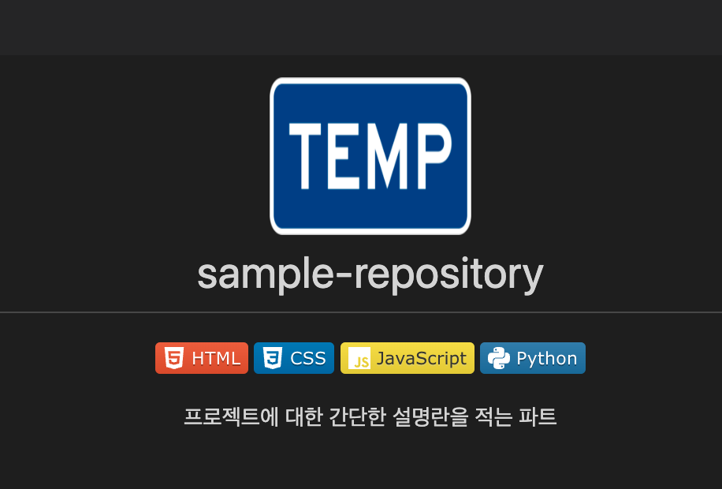

<div align="center">
	
	<h1> sample-repository </h1>
	<!--  # 사용한 언어스택 -->
	<p>
		<!-- 
			https://shields.io/
			https://simpleicons.org/
			ex : https://img.shields.io/badge/<LABEL>-<MESSAGE>-<COLOR>?logo=$&logoColor=$
		-->
		
		
		
		
	</p>
	<p> 프로젝트에 대한 간단한 설명란을 적는 파트 </p>
	<p> github repo 설명정리를 위한 견본 </p>
</div>

## objects (목적)

간단한 설명으로 부족할때 이 프로그램을 왜 만들게 되었는지 적는 파트

중구난방으로 프로젝트의 설명이 적히는것이 보기에 안좋다고 느껴져서 견본을 만들어두고 가져다쓰기위해서 적게되었습니다.

## Usage (실행방법)

프로그램을 어떻게 실행하는지 적는 파트

```
./a.out
```

## Preview (프로젝트 내용)

프로젝트에 어떤것이 담겨있는지 적는 파트



```c
printf("hello world");
```


## Working list (구현 예정)

앞으로 구현할 및 필요한 사항들
- sample-repository 정리하기
- img 추가하기

## Contribute (만든이 혹은 기여자)

누가 만들었는지

Git. [@JunMoKang](https://github.com/moaoh)  

<!--
	프로젝트 제목
	기술스택
	프로젝트에 대한 간단한 설명
	목적 (왜 만들게 되었는지)
	실행방법
	프로젝트 내용 & Preview
	폴터구조
	Working list
	만든이
-->